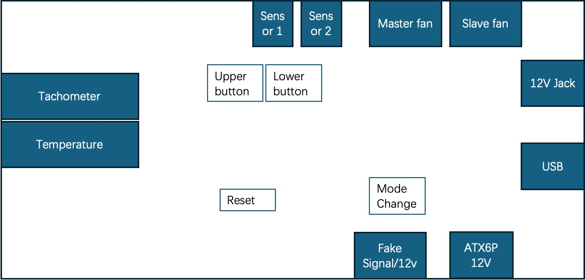

# smartfan

# Introduction
This project is used to make a controller that uses to make the Juniper SRX320 firmware more silent. The device has 2 4cm fan and it's very noisy when the device under heavy workload. 
I attempted to use other silence fan to replace the old one but the cooling efficiency is not good.

# Base design
The project based on Micropython project and RP2040 chip, the total cost is ~$8. The project need to meet the below requirements:

- Control the 4-wire fan speed
- The speed curve can be changed
- The setting can be saved
- The easy way to identify the FAN or sensors which one of them has hardware failure

# Board picture

# Illustration

# How to use this board
0. The MODE button can change the board between FIX mode and AUTO mode, and the MODESEL LED will be on/off.
    - Push this button will trigger a forcibly time.sleep in 6 seconds to ensure that all configurations are saved.
1. In AUTO mode, user can set the temperature range through "HIGH" button and "LOW" button.
    - HIGH button can change the upper level in 40 degrees to 70 degrees.
    - LOW button can change the lower level in 0 degrees to 30 degrees.
    - The PWM duty will be recalculated with the new temperature range.
2. In FIX mode, user can set the PWM duty through  "HIGH" button and "LOW" button.
    - Push those 2 buttons, and the PWM duty will be recalculated with the new range.
3. The system checks the configuration every 5 seconds, and any configuration will be saved.
4. The board has 2 ways to detect temperature through 18B20. System will align the PWM duty to the higher temperature and the temperature range.
5. Any sensors getting offline doesn't affect the system running.
6. If all sensors are lost, FANs have no tachometer, and the PWM duty reaches 100%, the Buzzer and all LEDs will alert you.
7. Each exception will be recorded to the internal FLASH memory.
